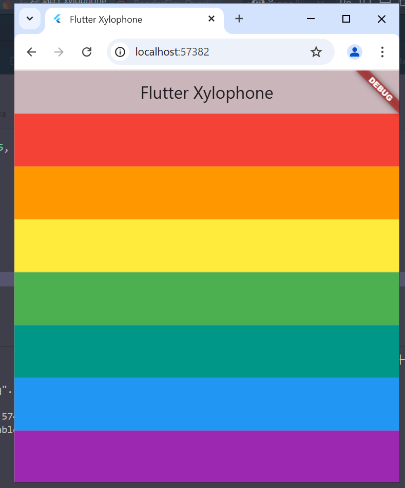

# Dự án Xylophone

Dự án Xylophone trong Flutter là một ứng dụng cho phép người dùng chọn một dòng màu và phát âm thanh tương ứng.

## Nội dung tìm hiểu

- Sử dụng package `audio_players` để xây dựng ứng dụng phát âm thanh.

## Chức năng thực hiện

- Ứng dụng cho phép người dùng nhấn các phím màu để phát âm thanh tương ứng.

## Hình ảnh

## Bắt đầu

Nếu đây là dự án Flutter đầu tiên của bạn, hãy tham khảo một vài tài nguyên dưới đây để bắt đầu:

- [Lab: Write your first Flutter app](https://docs.flutter.dev/get-started/codelab)
- [Cookbook: Useful Flutter samples](https://docs.flutter.dev/cookbook)

Để được hỗ trợ trong việc phát triển Flutter, hãy xem tài liệu [trực tuyến](https://docs.flutter.dev/), nơi cung cấp hướng dẫn, mẫu mã, và tài liệu tham khảo API đầy đủ.